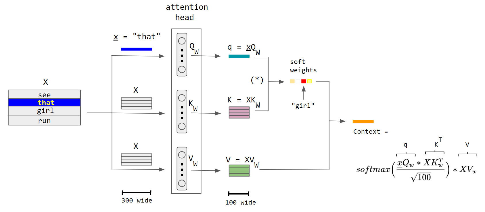

# llama2-py-inference
Pythonized version of [llama2.c](https://github.com/karpathy/llama2.c)

# Poetry environment
The dependencies and environment are managed using [Poetry](https://python-poetry.org/).

## Pre-requisites
You will need to install a few training sets,
for example the mini stories from [llama.c](https://github.com/karpathy/llama2.c#models).

```shell
wget --directory-prefix=data https://huggingface.co/karpathy/tinyllamas/resolve/main/stories15M.bin
```

**Important** Run first `poetry install` from the command line in order
for the modules in the _src_ directory to become accessible.

## Running llama2

```shell
poetry run llama2 data/stories15M.bin 0.8 256 "In that small Swiss town"
```

For testing purposes, you can set the _seed_ option to some value, so as to always get the same output:

```shell
poetry run llama2 --seed=1 data/stories15M.bin 0.8 256 "In that small Swiss town"
```

Generated output for that particular seed:
```text
<s>
In that small Swiss town, there was a little girl named Lily. She loved to sit in her chair and read her favorite novel. One day, Lily asked her mom if she could help her put some sour candies in her book. 
Her mom said, "Sure, Lily! Let's start by getting some candies." 
Lily went to the kitchen and grabbed a bag of sour candies. She put them in her book and poured the candies into her book. 
Lily's mom smiled and said, "Wow, Lily! You're such a good helper. Did you have fun with your book?" 
Lily replied, "Yes, Mommy! I folded my book and brought some candy to share with you." 
Her mom smiled and said, "That's very kind of you, Lily. You're such a good helper!" 
Lily felt proud of herself and continued to read her books, feeling happy and content.
<s>
```

# _Attention_ architecture

From [Wikipedia](https://en.wikipedia.org/wiki/Attention_(machine_learning)):

The Q and K sub-networks of a single "attention head" calculate the soft weights, originating from the word "that".
(Encoder-only QKV variant).
The sentence is sent through 3 parallel streams (left), which emerge at the end as the context vector (right).
The word embedding size is 300 and the neuron count is 100 in each sub-network of the attention head.

The capital letter **X** denotes a matrix sized 4 × 300, consisting of the embeddings of all four words.
The small underlined letter _x_ denotes the embedding vector (sized 300) of the word "that".
The attention head includes three (vertically arranged in the illustration) sub-networks, each having 100 neurons
with a weight matrix sized 300 × 100.

The asterisk within parenthesis "(*)" denotes the softmax( qKT / √100 ), i.e. not yet multiplied by the matrix V.
Rescaling by √100 prevents a high variance in qKT that would allow a single word to excessively dominate the softmax
resulting in attention to only one word, as a discrete hard max would do.

_Notation_: the commonly written row-wise softmax formula above assumes that vectors are rows, which contradicts the
standard math notation of column vectors. More correctly, we should take the transpose of the context vector and use
the column-wise softmax, resulting in the more correct form

`Context = (XV_W)T × softmax( (K_W X^T) × (xQ_w)^T / √100 ).
`
